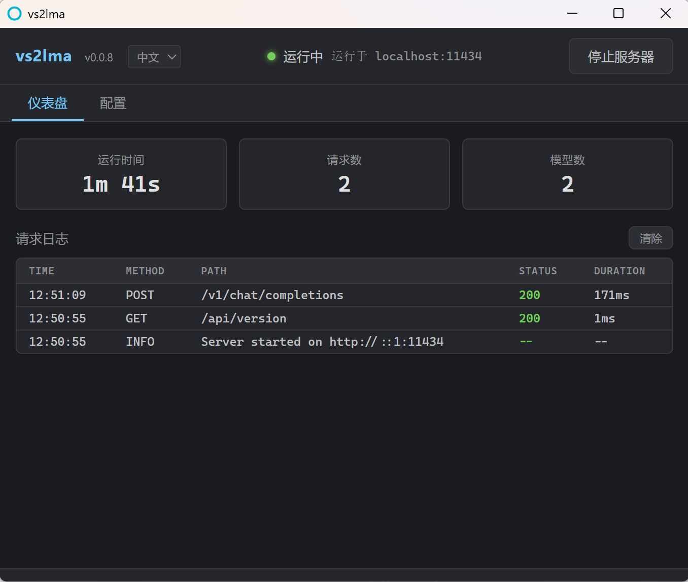

[English](README.md) | [中文](README.zh-CN.md)

# vs2lma

**vs2lma** 是一个 Windows 桌面应用程序，内置轻量级代理服务器，可将兼容 **DeepSeek** 或 **OpenAI** 格式的 API 请求转换为 **Ollama** 兼容请求。它使 **Visual Studio Copilot** 和 **VSCode Copilot Chat** 等工具能够通过模拟的 Ollama 端点与第三方 API 交互。

> 本项目基于 [o2lma](https://github.com/wrtx-dev/o2lma)，一个由 [wrtx-dev](https://github.com/wrtx-dev) 开发的 CLI 代理工具。vs2lma 在其基础上增加了 Windows 系统托盘 GUI、配置管理、连接测试和请求监控功能。

## 功能特性

- **API 兼容性**：将 DeepSeek/OpenAI 格式的请求转换为 Ollama 兼容请求
- **系统托盘**：在 Windows 通知区域静默运行，支持右键菜单操作
- **配置界面**：通过桌面窗口填写 API URL、密钥、端口和能力选项
- **连接测试**：启动服务器前验证 API 凭证是否可用
- **实时监控**：仪表盘显示运行时间、请求数量和实时请求日志
- **双语支持**：支持中文和英文，根据系统语言自动切换
- **CLI 模式**：仍可作为命令行工具使用 — `npx vs2lma --apikey sk-...`

## 安装

### 前置条件

- [Node.js](https://nodejs.org/) (v18+)
- [Rust](https://www.rust-lang.org/tools/install) (Tauri 桌面框架需要)

### 从源码构建

```bash
git clone https://github.com/wrtx-dev/vs2lma.git
cd vs2lma
npm install
npm run build
npm run tauri dev      # 开发模式运行
npm run tauri build    # 打包为 Windows 安装程序
```

### CLI 模式运行

```bash
npm install
npm run build
node dist/index.js --url https://api.deepseek.com --apikey sk-xxx --port 11434
```

## 配置

通过桌面界面（配置标签页）或命令行参数/环境变量进行配置：

### 命令行选项

```bash
npx vs2lma --url [API_BASE_URL] --apikey [API_KEY] --host [HOST] --port [PORT] --cap [CAPABILITIES]
```

选项说明：

- `--url`：API 基础 URL（默认：https://api.deepseek.com）
- `--apikey`：API 认证密钥
- `--host`：服务器主机地址（默认：localhost）
- `--port`：服务器端口（默认：11434）
- `--cap`：附加能力（可选：tools, thinking）

### 环境变量

```bash
export BASE_URL="https://api.deepseek.com"
export API_KEY="your-api-key"
```

## 使用方法

1. 从开始菜单启动 **vs2lma**，或运行 `npm run tauri dev`
2. 在配置标签页填写 **API Key** 和 **Base URL**，点击 **保存配置**
3. 点击 **测试连接** 验证凭证
4. 点击 **启动服务器** — 代理将在 `http://localhost:11434` 上运行
5. 配置客户端（Visual Studio、VSCode Copilot）使用 `http://localhost:11434` 作为 Ollama 端点
6. 在仪表盘标签页监控请求

## API 端点

服务器提供与 Ollama 兼容的端点：

- `GET /api/version` — 返回服务器版本
- `POST /api/show` — 返回模型能力
- `GET /api/tags` — 列出可用模型
- `POST /v1/chat/completions` — 代理聊天补全请求

## 致谢

- 代理引擎基于 [o2lma](https://github.com/wrtx-dev/o2lma)，作者 [wrtx-dev](https://github.com/wrtx-dev)
- 桌面包装使用 [Tauri](https://tauri.app/) 构建
- 服务器框架：[Hono](https://hono.dev/)

## 截图




## 许可证

[MIT](https://choosealicense.com/licenses/mit/)